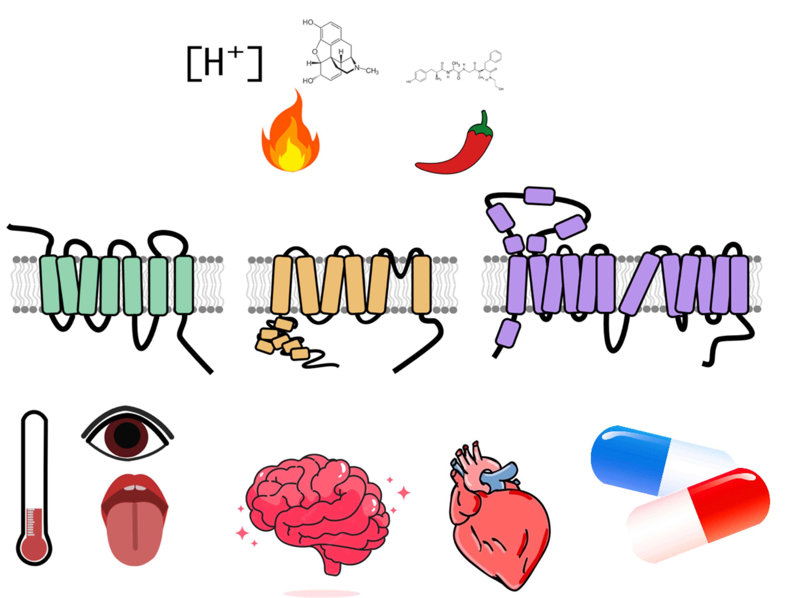

# Welcome to the Coyote-Maestas Lab!
{: .display-4}
 
We are part of the [Department of Bioengineering and Therapeutic Sciences](http://bts.ucsf.edu/), and the [California Institute of Quantitative Biosciences (QB3)](http://qb3.org/).
{: .welcomefont}

{:style="max-width: 100%; height: auto;"}

Our research focuses on building biophysical, molecular, and cellular understandings of the secret life of membrane proteins.  We build and apply scalable technologies to learn how membrane proteins underlie our physiology, what goes awry in disease, and how to better treat these diseases with therapeutics.

{: .welcomefont}

We are located in Byers Hall on the Mission Bay Campus of UCSF.
{: .welcomefont}
